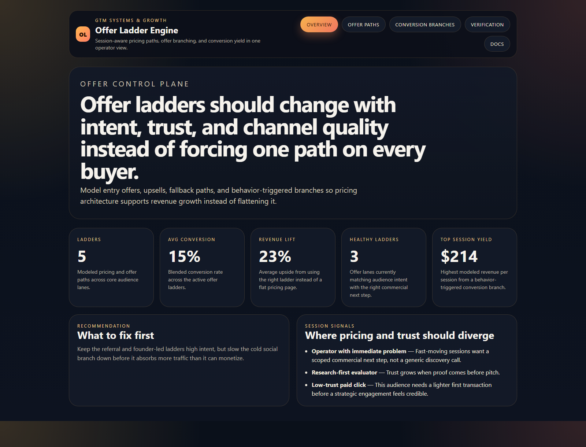
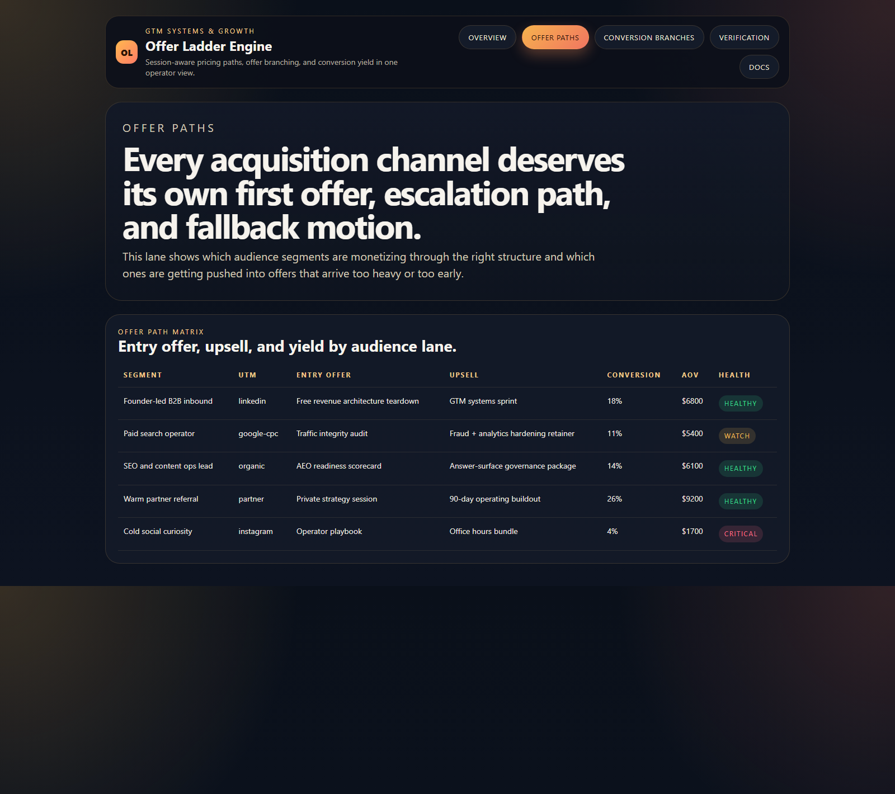
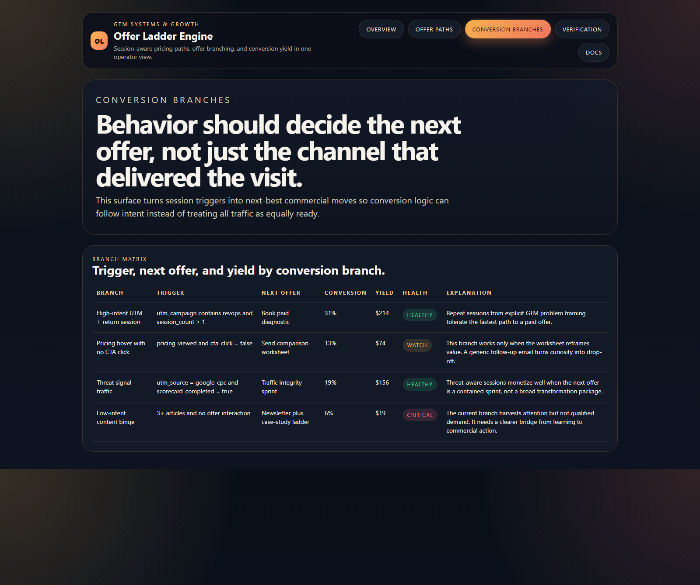
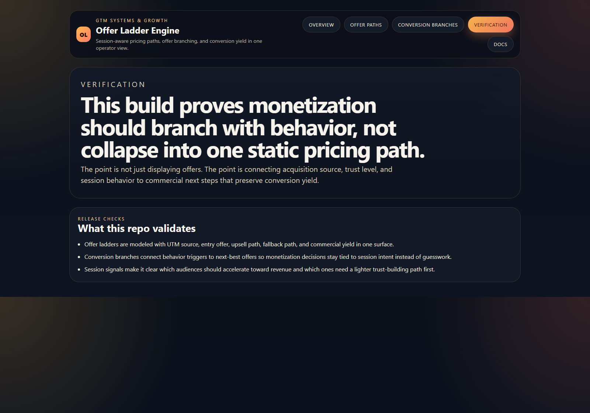

# Offer Ladder Engine

TypeScript control plane for dynamic offer ladders, session-aware pricing paths, conversion branching, and revenue-yield posture.

## Why this exists

One pricing page is almost never the right pricing system:
- partner referrals can absorb a high-intent offer immediately
- paid traffic often needs a lighter first transaction before trust exists
- organic research traffic converts better when proof comes before pitch
- social curiosity gets burned when the ladder jumps straight to a sales call

`offer-ladder-engine` keeps those dynamics visible in one operator-facing surface so Growth, RevOps, and monetization teams can see which ladders are compounding revenue and which ones are flattening it.

## Routes

- `/`
- `/offer-paths`
- `/conversion-branches`
- `/verification`
- `/docs`

## API

- `/api/dashboard/summary`
- `/api/offer-paths`
- `/api/conversion-branches`
- `/api/session-signals`
- `/api/verification`
- `/api/sample`

## Screenshots






## Local Development

```powershell
cd offer-ladder-engine
npm install
npm run dev
```

Open:
- [http://127.0.0.1:5310/](http://127.0.0.1:5310/)
- [http://127.0.0.1:5310/offer-paths](http://127.0.0.1:5310/offer-paths)
- [http://127.0.0.1:5310/conversion-branches](http://127.0.0.1:5310/conversion-branches)
- [http://127.0.0.1:5310/verification](http://127.0.0.1:5310/verification)
- [http://127.0.0.1:5310/docs](http://127.0.0.1:5310/docs)

## Validation

- `npm run build`
- `npm run test`
- `npm run demo`
- `npm run smoke`
- `npm run render:assets`

## Docs

- [Architecture](./docs/architecture.md)
- [Origin](./docs/ORIGIN.md)
- [Changelog](./CHANGELOG.md)
